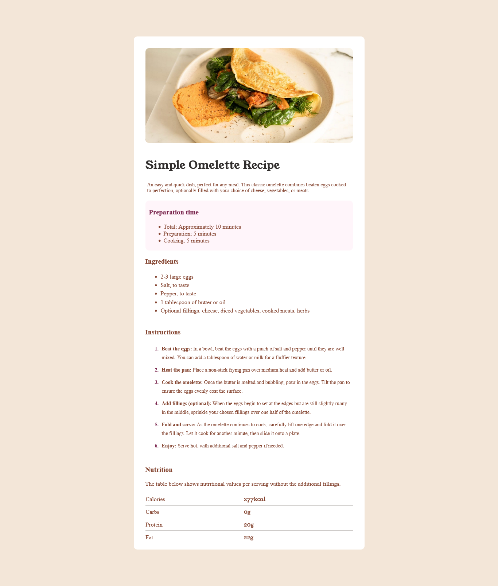

# Frontend Mentor - Recipe page solution

This is a solution to the [Recipe page challenge on Frontend Mentor](https://www.frontendmentor.io/challenges/recipe-page-KiTsR8QQKm). 

## Table of contents

- [Overview](#overview)
  - [Screenshot](#screenshot)
  - [Links](#links)
- [My process](#my-process)
- [Author](#author)

## Overview

### Screenshot

### Links

- Solution URL: [view page](https://github.com/briankrou/recipe-page-Frontend-mentor-)
- Live Site URL: [view](https://briankrou.github.io/recipe-page-Frontend-mentor-/)

## My process

## Author

- Website - [briankrou.com](https://www.briankrou.com)
- Frontend Mentor - [@briankrou](https://www.frontendmentor.io/profile/briankrou)
